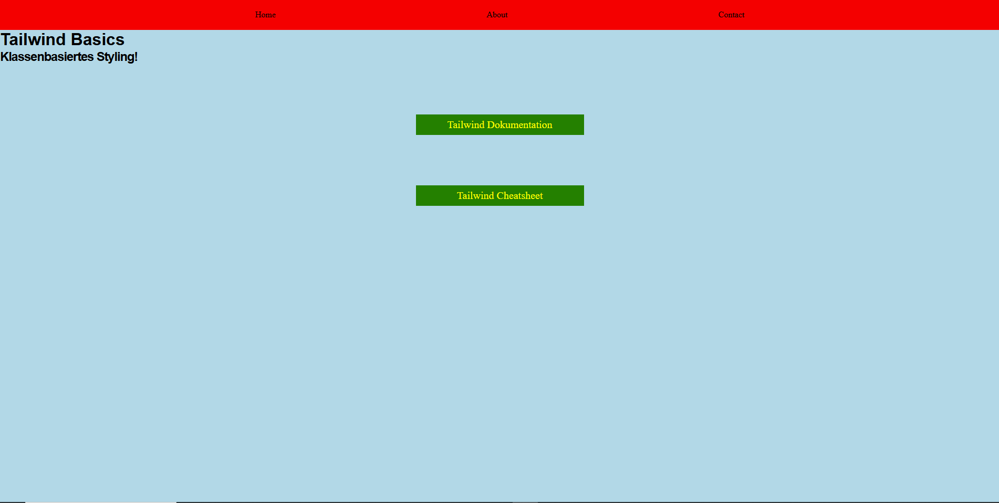

# Tailwind Basics (Leicht)

## Ziel der Aufgabe

Ziel dieser Aufgabe ist es einmal ein Projekt mit Tailwind aufzusetzen, indem du die Installation nach der Anweisung in den Resources durfürst. Anschließend geht es darum sich mit dem [Tailwind Cheatsheet](https://nerdcave.com/tailwind-cheat-sheet) zu beschäftigen.

---

1. Lies dir die Resources durch und befolge die Schritte um Tailwind in diesem Projekt verwenden zu können (Schritt 1-6).

2. Mache einen Reset in der CSS-Datei um allen Elementen das Standardstyling weg zu nehmen.

3. Beantworte folgende Fragen in dieser Datei:

   - Was ist NPM?
     - Antwort:
   - Was ist das besondere an Tailwind im gegensatz zu anderen CSS-Frameworks wie beispielsweise Bootstrap?
     - Antwort:
   - Wie ist die Kurzform von `npm install ...`?
     - Antwort:
   - Was ist der Unterschied zwischen `npm` und `npx`?
     - Antwort:
   - Wofür ist die `package.json`?
     - Antwort:
   - Was ist ein Script?
     - Antwort:
   - Was ist ein Build Prozess?
     - Antwort:
   - Was macht `--watch` im Script?
     - Antwort:

## Löse die folgenden Aufgaben mit Tailwind

4. Die `ul` in der `nav` Soll eine Breite von 50% haben.

5. Entferne die Listenpunkte und sorge für Platz zwischen den Listitems.

6. Die Navbar sollte `sticky` sein

7. Gib dem `main`-Container eine Höhe von `110vh` und gib ihm einen hellblauen Hintergrund.

8. Die beiden Überschriften sollen `font-family: sans-serif` sein.

9. Die Links im `main` sollen eine Breite von `20rem` haben mit einer grünen Hintergrund- und Gelben Schriftfarbe.

10. Setze die `font-size` der Links auf `1.25rem` mit einem `padding-top` und `padding-bottom` von `0.5rem`

11. Zentriere die Links und gib ihnen `6rem` Abstand nach oben und unten.

### Bonus

12. Die beiden Links sollen einen `hover`-Effekt haben, der die Farben von `background-color` und `color` vertauscht.

## Preview

